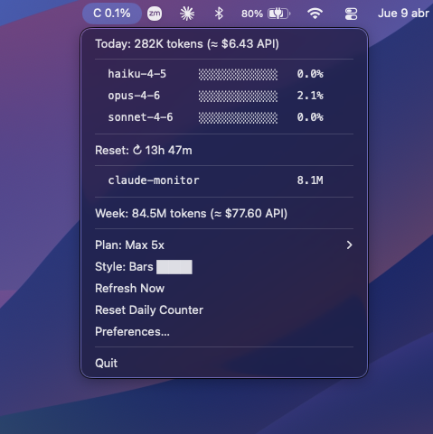

# Claude Code Cost Monitor

> **macOS only** — requires macOS 12+

A lightweight macOS menu bar app that tracks your [Claude Code](https://claude.ai/code) spending and token usage in real time — by reading local logs from `~/.claude/projects/`. No API keys required.

## Installation

```bash
git clone https://github.com/SirMatoran/claude-monitor.git
cd claude-monitor
```

### Option A: Download the .app (recommended)

Download `Claude.Monitor.app.zip` from the [latest release](https://github.com/SirMatoran/claude-monitor/releases/latest), unzip, and move to `/Applications/`.

### Option B: Run from source

Requires Python 3.11+ and [uv](https://docs.astral.sh/uv/):

```bash
uv sync
uv run python -m claude_monitor
```

## Screenshot

<p align="center">
  
</p>

## Features

- **Real-time cost tracking** — displays `C $0.42` in the macOS menu bar, auto-refreshes every 30 seconds
- **Subscription mode** — switch to `C 45%` to track token usage against your plan limits (Pro, Max 5x, Max 20x)
- **Extra usage tracking** — configurable budget for usage beyond plan limits; title switches to `C $12.50/$60` when in extra usage zone
- **Per-project breakdown** — see which projects are costing you the most
- **Weekly summary** — 7-day history with daily averages
- **Cost alerts** — native macOS notification when spending exceeds a configurable threshold (default: $5.00)
- **Daily reset** — reset the counter to $0.00 without losing data
- **CLI report** — formatted terminal output for quick checks
- **Standalone .app** — package as a native macOS app (~22 MB), no Dock icon
- **Auto-update** — checks GitHub Releases every 24h, one-click update from the menu
- **Privacy-first** — only reads numeric fields (`usage`, `timestamp`, `model`). Never reads prompt content.
- **API integration (optional)** — connect your Anthropic API key to see real-time rate limit usage and actual billing costs
- **Fully offline by default** — works without any API key, everything computed locally

## Usage

### Menu Bar App

```bash
uv run python -m claude_monitor
```

The menu shows:

| Item | Description |
|------|-------------|
| Today's total | Cost (or % in subscription mode), API calls, and token count |
| Project list | Up to 10 projects sorted by cost |
| Weekly summary | 7-day total with daily average |
| Plan | Switch between Pro, Max 5x, Max 20x (subscription mode) |
| Extra Usage Limit | Configure extra usage budget in USD (subscription mode) |
| Refresh Now | Force an immediate update |
| Reset Daily Counter | Zero out today's display (preserves actual data) |
| Preferences | Open `config.json` in TextEdit |
| Update available | Shown when a newer version exists on GitHub (click to install) |
| Quit | Exit the app |

### Usage Modes

The app has two modes, configurable in `~/.claude-monitor/config.json`:

**API mode** (default) — shows estimated cost in USD based on token usage:
```
C $0.42
```

**Subscription mode** — shows percentage of plan limit consumed:
```
C 45%
```

To switch modes, edit `~/.claude-monitor/config.json`:

```json
{
  "usage_mode": "subscription",
  "plan": "max_5x"
}
```

Available plans: `pro`, `max_5x`, `max_20x`. You can also change the plan from the menu.

#### Extra Usage

Claude allows spending beyond your plan limits at additional cost. To track this, configure an extra usage budget via the **Extra Usage Limit...** menu item or in `config.json`:

```json
{
  "usage_mode": "subscription",
  "plan": "max_5x",
  "extra_usage_limit_usd": 60,
  "extra_usage_alert_pct": 90
}
```

When your plan reaches 100% and extra usage is configured, the title switches from percentage to USD format:
```
C $12.50/$60
```

A native macOS notification fires when you reach the alert threshold (default: 90% of your extra budget). Set `extra_usage_limit_usd` to `0` to disable.

### CLI Report

```bash
uv run python -m claude_monitor.cli
```

```
============================================================
  Claude Code Cost Report — Wednesday, April 08, 2026
============================================================

  Today's total:  $35.8810
  Total tokens:   11,898,884
  API calls:      337

  Project                              Cost    Calls
  ------------------------------ ---------- -------
  contextual-url-learning          $18.4755      197
  claude-monitor                   $17.4055      140

  Last 7 days:
    Mon 04/06  $20.6719
    Tue 04/07  $2.4660
    Wed 04/08  $35.8810 <-- today
                 --------
         Week  $59.0189  (avg $8.4313/day)
```

### Build Standalone .app

```bash
uv run pip install pyinstaller
uv run python setup.py
open dist/Claude\ Monitor.app
```

The packaged app:
- Runs standalone (bundles Python and all dependencies)
- Doesn't appear in the Dock (`LSUIElement: true`)
- Can be copied to `/Applications/`
- Auto-updates when a new GitHub Release is published

## API Integration (Optional)

You can optionally connect an Anthropic API key to unlock additional features:

| Key type | Rate limits | Real billing costs |
|----------|:-----------:|:------------------:|
| No key (default) | -- | -- |
| Standard API key | Yes | -- |
| Admin API key | Yes | Yes |

### Getting your API key

1. Go to the [Anthropic Console](https://console.anthropic.com/).
2. Sign in (or create an account).

**For a standard API key** (shows rate limit usage):

3. Navigate to **Settings > API Keys**.
4. Click **Create Key**, give it a name, and copy it. It starts with `sk-ant-api...`.

**For an admin API key** (also shows actual billing costs):

> Admin keys are only available for **organization accounts** (Team or Enterprise plans). Individual accounts cannot create admin keys.

3. Navigate to **Settings > Admin Keys** (only visible to organization admins).
4. Click **Create Admin Key**, give it a name, and copy it. It starts with `sk-ant-admin...`.

### Configuring the key in Claude Monitor

- Open the menu bar app and click **Configure API Key...**
- Paste your key and click **Save**

The key is stored in `~/.claude-monitor/config.json` with restricted file permissions (`0600`). You can also set it manually:

```json
{
  "anthropic_api_key": "sk-ant-api03-..."
}
```

### What each key type enables

**Standard key** — The app makes a lightweight call to the `count_tokens` endpoint (free, no token cost) every 60 seconds to read rate limit headers. The menu shows:

```
Tokens: 42% used · resets in 38s
```

**Admin key** — In addition to rate limits, the app queries the [Usage & Cost API](https://docs.anthropic.com/en/docs/administration/administration-api/usage-cost-api) every 5 minutes to show your actual billing cost (instead of the local estimate). The title shows a checkmark when using API-sourced costs: `C $0.42 ✓`.

## Configuration

Settings are stored in `~/.claude-monitor/config.json` (created automatically with defaults on first run):

```json
{
  "refresh_interval_seconds": 30,
  "cost_alert_threshold_usd": 5.0,
  "max_projects_in_menu": 10,
  "anthropic_api_key": "",
  "usage_mode": "api",
  "plan": "max_5x",
  "display_style": "bar",
  "auto_update_enabled": true,
  "extra_usage_limit_usd": 0,
  "extra_usage_alert_pct": 90
}
```

Edit via the Preferences menu item or manually.

## Supported Models & Pricing

Costs are estimated locally from token counts using these prices (USD per million tokens):

| Model | Input | Output | Cache Read | Cache Create 5m | Cache Create 1h |
|-------|------:|-------:|-----------:|----------------:|----------------:|
| claude-opus-4-6 | $5.00 | $25.00 | $0.50 | $6.25 | $10.00 |
| claude-sonnet-4-6 | $3.00 | $15.00 | $0.30 | $3.75 | $6.00 |
| claude-haiku-4-5 | $1.00 | $5.00 | $0.10 | $1.25 | $2.00 |

The app also fetches updated prices from Anthropic's documentation automatically (cached for 24h). Prices can be overridden in [config.py](claude_monitor/config.py).

## Project Structure

```
claude-monitor/
├── claude_monitor/
│   ├── __init__.py
│   ├── __main__.py        # python -m claude_monitor
│   ├── models.py          # Dataclasses: TokenUsage, CostEntry, ProjectStats, DailyReport, etc.
│   ├── config.py          # Model pricing, constants, ConfigManager
│   ├── log_parser.py      # ClaudeLogParser: JSONL reading and parsing
│   ├── api_client.py      # Anthropic API: rate limits and cost report
│   ├── pricing_fetcher.py # Auto-fetch prices from Anthropic docs
│   ├── extra_usage.py     # Extra usage calculation for subscription mode
│   ├── updater.py         # Auto-update via GitHub Releases
│   ├── cli.py             # Formatted terminal report
│   └── app.py             # Menu bar app (rumps)
├── tests/                 # 228 tests
├── docs/
├── .github/workflows/
│   └── release.yml        # CI: build .app + create GitHub Release on tag push
├── setup.py               # Build script (PyInstaller → .app)
├── requirements.txt
└── README.md
```

## Tests

```bash
uv run pytest
```

## How It Works

1. **Reads** JSONL session files from `~/.claude/projects/` (including subagent logs)
2. **Parses** only numeric fields — token counts, timestamps, and model names
3. **Deduplicates** streaming messages by `message.id`
4. **Calculates** cost using the pricing table (or fetches real costs via Admin API)
5. **Groups** entries by project (extracted from `cwd` in the logs)
6. **Displays** the running total in the menu bar, updated every 30 seconds

## For Maintainers

### Publishing a Release

1. Bump `__version__` in `claude_monitor/__init__.py`
2. Commit and push
3. Tag and push: `git tag v1.1.0 && git push origin v1.1.0`
4. GitHub Actions builds the `.app` and creates the release automatically

Users running the `.app` will see "Update available (v1.1.0)" in the menu within 24 hours.

## License

MIT
